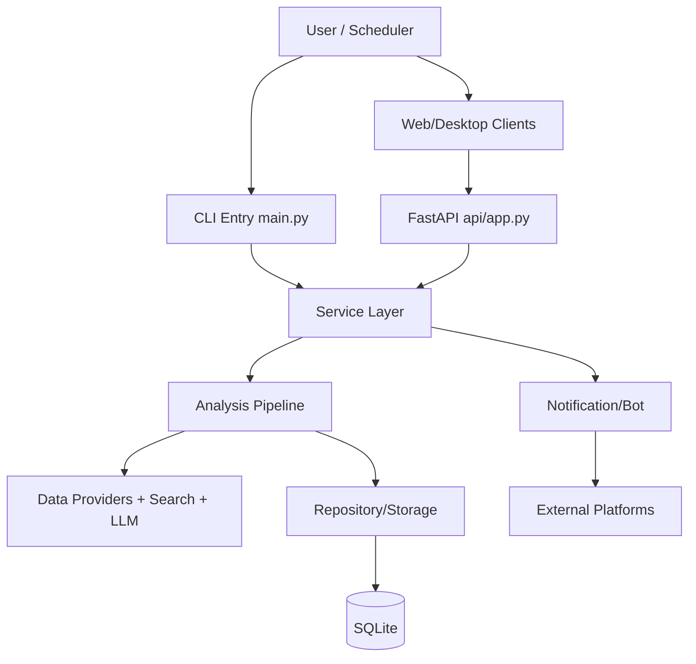

# 模块图（Mermaid固定模板）

```mermaid
graph TD
    User[User / Scheduler]
    CLI[CLI Entry main.py]
    API[FastAPI api/app.py]
    Web[Web/Desktop Clients]
    Service[Service Layer]
    Pipeline[Analysis Pipeline]
    Provider[Data Providers + Search + LLM]
    Repo[Repository/Storage]
    DB[(SQLite)]
    Notify[Notification/Bot]
    Ext[External Platforms]

    User --> CLI
    User --> Web
    Web --> API
    CLI --> Service
    API --> Service
    Service --> Pipeline
    Pipeline --> Provider
    Pipeline --> Repo
    Repo --> DB
    Service --> Notify
    Notify --> Ext
```

## 变更规则
1. 模块边界变化必须更新此图。
2. 依赖方向变化必须更新此图。
3. 新增模块必须标注 `module_id` 并同步 `system-architecture.md`。
