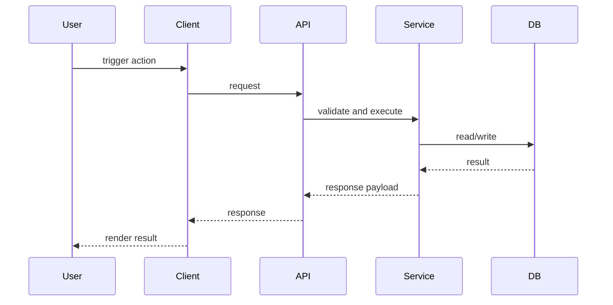

# 时序图（Mermaid固定模板）

```mermaid
sequenceDiagram
    participant U as User
    participant C as Client
    participant A as API
    participant S as Service
    participant D as DB

    U->>C: trigger action
    C->>A: request
    A->>S: validate and execute
    S->>D: read/write
    D-->>S: result
    S-->>A: response payload
    A-->>C: response
    C-->>U: render result
```

## 变更规则
1. 关键业务流程变化必须更新此图。
2. 异常分支变化必须补充 alt/opt 分支。
3. 时序图更新需关联 feature_id 或 requirement_id。

